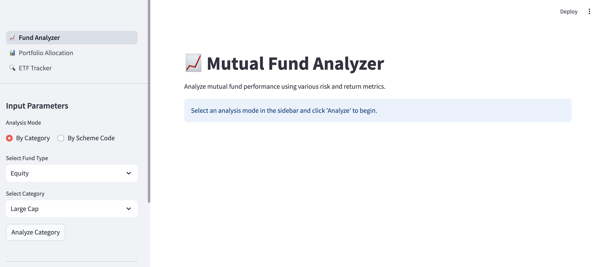
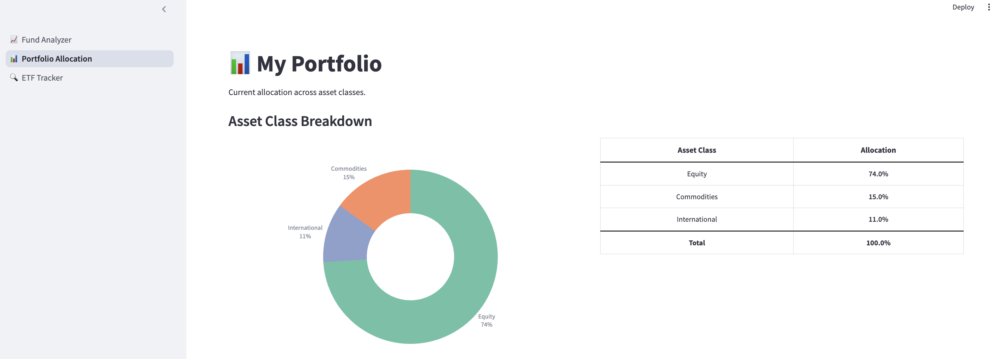
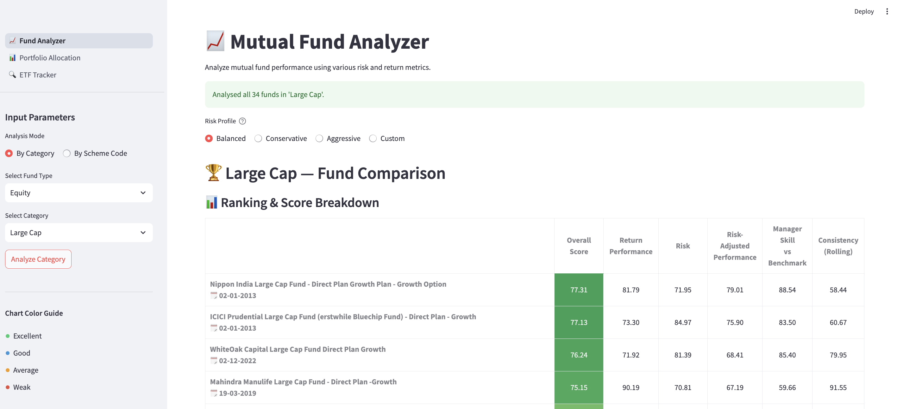
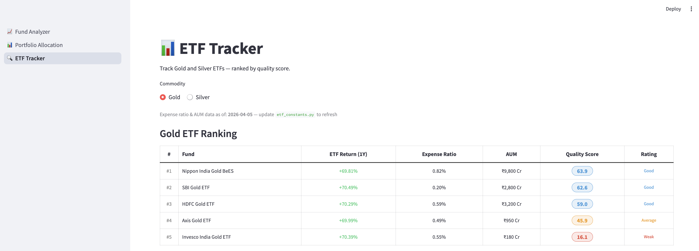

# 📈 Mutual Fund & Portfolio Analyzer

A crisp, high-performance tool for mutual fund quantitative analysis and personal portfolio tracking.

## 🚀 Quick Start

1. **Setup Environment**:
   ```bash
   python3 -m venv venv && source venv/bin/activate
   pip install -r requirements.txt
   ```

2. **Run Dashboard**:
   ```bash
   venv/bin/streamlit run app.py
   ```

## 📸 Screenshots

1. **Fund Analyzer**
   

2. **Portfolio Allocation**
   

3. **Category Comparison**
   

4. **ETF Tracker**
   

## 🛠️ Key Features

### 1. Fund Analyzer
- **Deep Quantitative Analysis**: 20+ metrics across Returns, Risk, Skill, and Consistency.
- **Relative Scoring**: Z-Score + Sigmoid pipeline for objective peer-group ranking.
- **Detailed Visuals**: Interactive charts for rolling CAGR, Drawdowns, and Alpha generation.

### 2. Portfolio Allocation
- **Asset Breakdown**: Real-time view of Equity (Core + Sectoral), International, and Commodities.
- **Smart Categorization**: Automatic "Sectoral -" prefixing for theme-based funds.
- **Visual Hierarchy**: Large category breakdown charts followed by detailed allocation tables.

### 3. ETF Tracker
- Track performance and allocation specifically for Exchange Traded Funds.

## 📁 Project Structure
- `app.py`: Main navigation hub.
- `pages/`: Individual dashboard modules (Analyzer, Portfolio, ETF).
- `mfa.py`: Core analysis engine.
- `constants/`: Configuration and portfolio data.
- `calculators/`: Modular math engines for static and rolling metrics.

## 📊 Requirements
- Python 3.10+
- Streamlit, Pandas, Plotly, MFTool

---
*Built for objective financial decision-making.*
